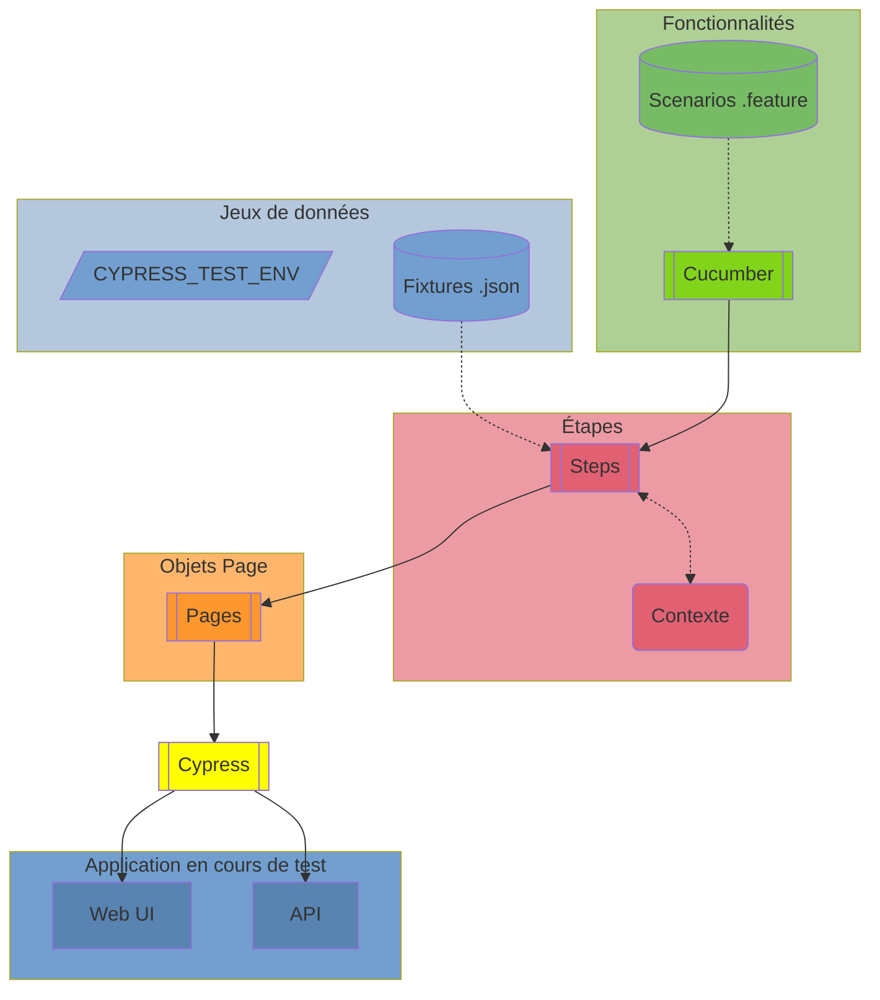

<h1 align="center">
  
  Cypress BDD Framework
  
</h1>

## Introduction

Ce projet présente une implémentation du **framework de test BDD pour Cypress avec Typescript**.

BDD signifie **Behavior Driven Development**. Il s'agît de décrire une fonctionnalité (feature en anglais) en un ensemble de scénarios.

Ces scénarios sont décris en utilisant le langage **Gherkin** (ici en français). **Cucumber** permet de faire le lien entre les étapes des scénarios et le code **Typescript**.

Ce code est composé de **page objects** (encapsulant les sélecteurs CSS et actions UI) et d'utilitaires **Cypress**.

Pour l'exécution des tests, nous utilisons un **préprocesseur Cucumber**, qui convertit les fichiers feature en tests exécutables par **Cypress**.

Ce projet présente différents types de test:

| Type de tests         | Répertoire                                     |
| --------------------- | ---------------------------------------------- |
| tests BDD             | [./cypress/e2e/bdd](./cypress/e2e/bdd/)       |
| tests API             | [./cypress/e2e/api](./cypress/e2e/api/)       |
| tests d'accessibilité | [./cypress/e2e/a11y](./cypress/e2e/a11y/)     |
| tests visuels         | [./cypress/e2e/visual](./cypress/e2e/visual/) |

## Structure du framework

| Elément                     | Répertoire                                             |
| --------------------------- | ------------------------------------------------------ |
| Fonctionnalités (Scenarios) | [./cypress/e2e](./cypress/e2e)                         |
| Jeux de données             | [./cypress/fixtures](./cypress/fixtures)               |
| Etapes (Steps)              | [./cypress/support/steps](./cypress/support/steps)     |
| Objets Page (Pages)         | [./cypress/support/pages](./cypress/support/pages)     |
| Contexte (Types)             | [./cypress/support/types](./cypress/support/types)     |
| Utilitaires (Helpers)       | [./cypress/support/helpers](./cypress/support/helpers) |
| Plugins Cypress             | [./cypress/plugins](./cypress/plugins)                 |
| Snapshots (pour les tests visuels)                  | [./cypress/snapshots](./cypress/snapshots)             |

### Schéma

## Scripts

| Script                  | Description                                            |
| ----------------------- | ------------------------------------------------------ |
| `yarn install`          | Installer Cypress et ses dépendences                   |
| `yarn clean`            | Supprimer les artifacts de test                           |
| `yarn clean:diff`       | Supprimer les snapshots en différence                  |
| `yarn prettier`         | Formatter le code des tests                            |
| `yarn lint`             | Vérifier le style du code des tests                    |
| `yarn cy:open`          | Ouvrir les tests E2E sur Cypress UI                    |
| `yarn cy:run`           | Exécuter les tests en ligne de commandes sur Electron  |
| `yarn cy:run:chrome`    | Exécuter les tests en ligne de commandes sur Chrome    |
| `yarn cy:run:firefox`   | Exécuter les tests en ligne de commandes sur Firefox   |
| `yarn cy:run:edge`      | Exécuter les tests en ligne de commandes sur Edge      |
| `yarn cy:run-all`       | Exécuter les tests sur Chrome, puis Firefox, puis Edge |
| `yarn cy:visual`        | Exécuter les tests visuels en ligne de commande        |
| `yarn cy:visual:update` | Mettre à jour les snapshots ayant changés              |
| `yarn report`           | Générer le rapport de test                             |

## Liens utiles

- [Installation du framework à partir de zéro](./INSTALLATION.md)
- [Gherkin Reference (EN)](https://cucumber.io/docs/gherkin/reference/)
- [Cypress Cucumber Preprocessor (EN)](https://github.com/badeball/cypress-cucumber-preprocessor/blob/master/docs/readme.md)
- [Introduction à Cypress (EN)](https://docs.cypress.io/guides/core-concepts/introduction-to-cypress)

## Remerciements

- Merci à [Jonas Amundsen](https://github.com/badeball) pour la maintenance du projet Cypress Cucumber Preprocessor
- Merci à l'équipe de Automation In Testing pour le site de démo [Restful Booker Platform](https://automationintesting.online/)

## Licence

Ce projet est concédé sous licence selon les termes de la [licence MIT](/LICENSE).
